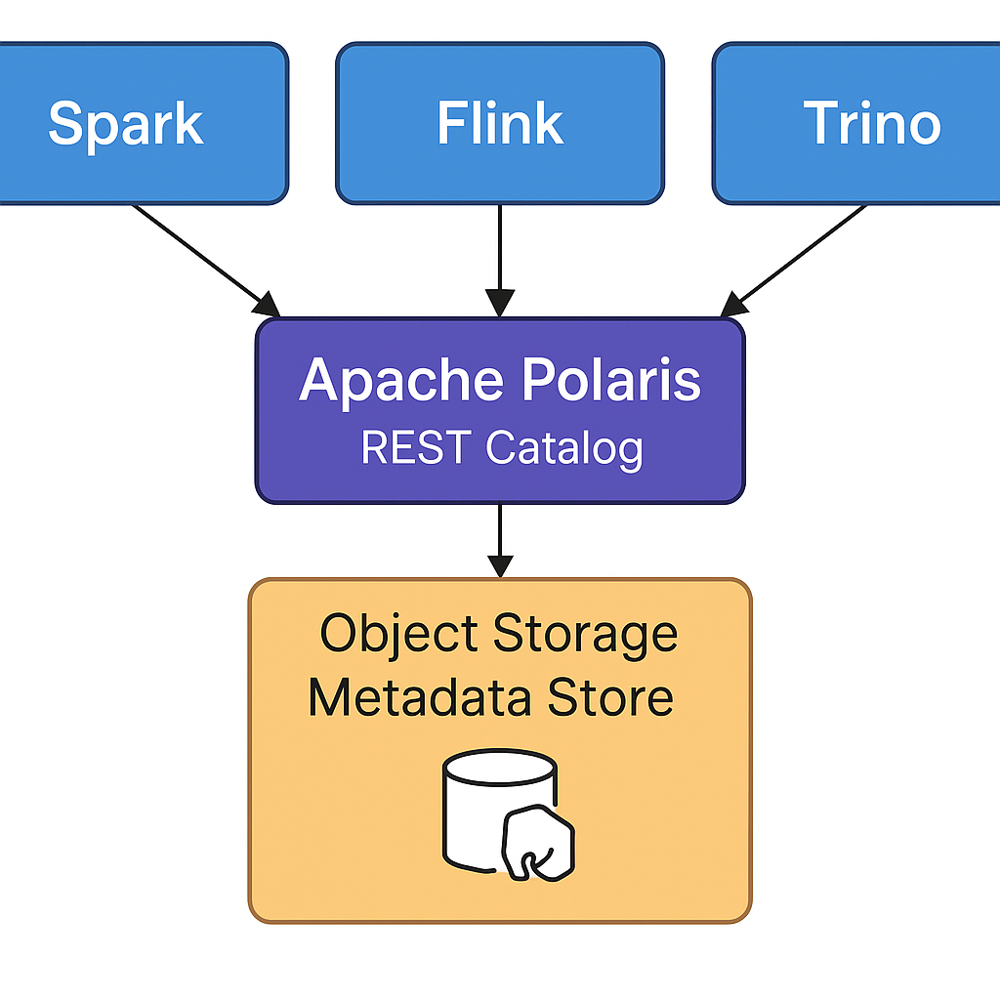

# Lakehouse Demo using Iceberg, Polaris, Trino and MinIO



## Services
 - Trino Web UI: http://localhost:8080
 - MinIO UI: http://localhost:9001 (admin/password)
 - MinIO API: http://localhost:9000
 - Polaris: http://localhost:8181

## Create an Iceberg catalog

Get access token
``` shell
ACCESS_TOKEN=$(curl -X POST \
  http://localhost:8181/api/catalog/v1/oauth/tokens \
  -d 'grant_type=client_credentials&client_id=root&client_secret=secret&scope=PRINCIPAL_ROLE:ALL' \
  | jq -r '.access_token')
```

Create an Iceberg catalog in Polaris
``` shell
  curl -i -X POST \
  -H "Authorization: Bearer $ACCESS_TOKEN" \
  http://localhost:8181/api/management/v1/catalogs \
  --json '{
    "name": "polariscatalog",
    "type": "INTERNAL",
    "properties": {
      "default-base-location": "s3://warehouse",
      "s3.endpoint": "http://minio:9000",
      "s3.path-style-access": "true",
      "s3.access-key-id": "admin",
      "s3.secret-access-key": "password",
      "s3.region": "dummy-region"
    },
    "storageConfigInfo": {
      "roleArn": "arn:aws:iam::000000000000:role/minio-polaris-role",
      "storageType": "S3",
      "allowedLocations": [
        "s3://warehouse/*"
      ]
    }
  }'
```

Check that the catalog was correctly created in Polaris:
``` shell
curl -X GET http://localhost:8181/api/management/v1/catalogs \
  -H "Authorization: Bearer $ACCESS_TOKEN" | jq
```

## Set Up Permissions

Create a catalog admin role
``` shell
curl -X PUT http://localhost:8181/api/management/v1/catalogs/polariscatalog/catalog-roles/catalog_admin/grants \
  -H "Authorization: Bearer $ACCESS_TOKEN" \
  --json '{"grant":{"type":"catalog", "privilege":"CATALOG_MANAGE_CONTENT"}}'
```

Create a data engineer role
``` shell
curl -X POST http://localhost:8181/api/management/v1/principal-roles \
  -H "Authorization: Bearer $ACCESS_TOKEN" \
  --json '{"principalRole":{"name":"data_engineer"}}'
```

Connect the roles
``` shell
curl -X PUT http://localhost:8181/api/management/v1/principal-roles/data_engineer/catalog-roles/polariscatalog \
  -H "Authorization: Bearer $ACCESS_TOKEN" \
  --json '{"catalogRole":{"name":"catalog_admin"}}'
```

Give root the data engineer role
``` shell
curl -X PUT http://localhost:8181/api/management/v1/principals/root/principal-roles \
  -H "Authorization: Bearer $ACCESS_TOKEN" \
  --json '{"principalRole": {"name":"data_engineer"}}'
```

Check that the role was correctly assigned to the root principal:
``` shell
curl -X GET http://localhost:8181/api/management/v1/principals/root/principal-roles -H "Authorization: Bearer $ACCESS_TOKEN" | jq
```

## Create an Iceberg table and run some queries

Create a schema first (a namespace in Polaris)
``` sql
CREATE SCHEMA db;
```

Activate the schema
``` sql
USE db;
```

Create a table:
``` sql
CREATE TABLE customers (
  customer_id BIGINT,
  first_name VARCHAR,
  last_name VARCHAR,
  email VARCHAR
);
```

Insert a few records in that table:
``` sql
INSERT INTO customers (customer_id, first_name, last_name, email) 
VALUES (1, 'Rey', 'Skywalker', 'rey@rebelscum.org'),
       (2, 'Hermione', 'Granger', 'hermione@hogwarts.edu'),
       (3, 'Tony', 'Stark', 'tony@starkindustries.com');
```

Query the table
``` sql
SELECT * FROM customers;
```

Update record
``` sql
UPDATE customers
SET last_name = 'Granger-Weasley'
WHERE customer_id = 2;
```

List table history
``` sql
SELECT snapshot_id, committed_at, summary
FROM "customers$snapshots"
ORDER BY committed_at DESC;
```

Query the table with time travel
``` sql
SELECT * FROM customers FOR TIMESTAMP AS OF TIMESTAMP '2025-08-05 09:53:43.994 UTC';
```